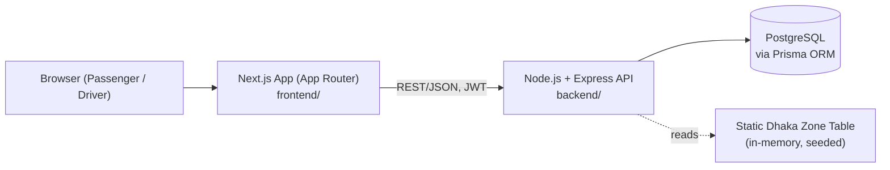
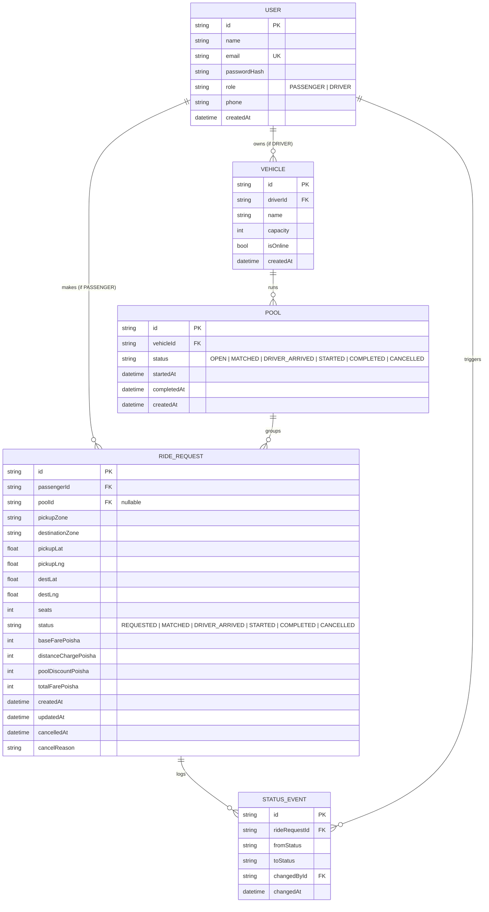

# Architecture & Data Model

## System Architecture



No queues, no cache layer, no microservices. A ride-pooling MVP at this
scale is bottlenecked by correctness of state transitions and capacity
enforcement, not by throughput — adding Kafka/Redis/K8s here would be
complexity with no job to do (see PRD §9 and the Bonus section for how
this would change at 1M-passenger scale).

## Entity-Relationship Diagram



## Ride / Pool Lifecycle

```
REQUESTED → MATCHED → DRIVER_ARRIVED → STARTED → COMPLETED
     └────────────────┴──────────────────┘
                       CANCELLED (only from REQUESTED or MATCHED)
```

- A `RideRequest` is the passenger-facing unit — each passenger always sees only their own request, status and fare.
- A `Pool` is the driver-facing unit — one `Pool` belongs to exactly one `Vehicle` trip and groups 1..N `RideRequest`s, as long as `sum(seats of active members) <= vehicle.capacity`.
- Driver actions (arrive/start/complete) act on the whole `Pool`; each member `RideRequest`'s status moves in lockstep with the pool.
- Passenger cancellation acts on their own `RideRequest` only, and is only allowed while status is `REQUESTED` or `MATCHED`.